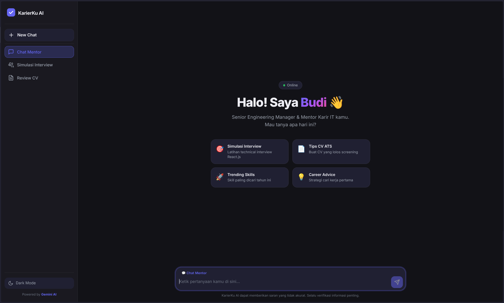
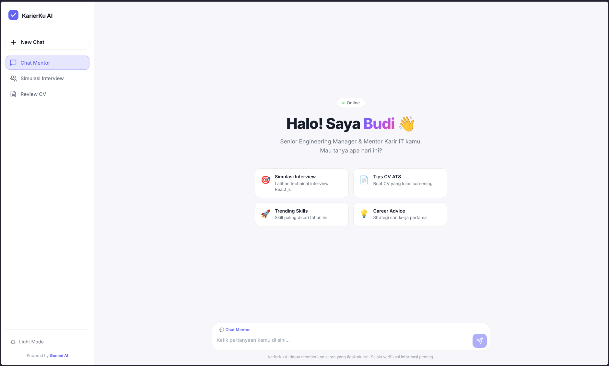

# KarierKu AI — Tech Career & Interview Mentor 🚀

> Asisten virtual berbasis **Gemini AI** untuk membantu pencari kerja di bidang IT.


## 📋 Tentang

KarierKu AI adalah chatbot interaktif yang berperan sebagai **"Budi"** — seorang Senior Engineering Manager yang membantu junior developer mempersiapkan karir di dunia IT. Fitur utama meliputi:

- 💬 **Chat Mentor** — Tanya jawab seputar karir IT, tips, dan saran profesional
- 🎯 **Simulasi Interview** — Latihan technical interview (React, Node.js, dll)
- 📄 **Review CV** — Analisis dan kritik konstruktif CV agar lolos ATS
- 🌙 **Dark/Light Mode** — UI modern dan responsif

## 🛠️ Tech Stack

| Layer | Teknologi |
|-------|-----------|
| Frontend | HTML5, CSS3, Vanilla JavaScript (Fetch API) |
| Backend | Node.js, Express.js |
| AI | Google Gemini 1.5 Flash (`@google/generative-ai`) |
| Env | dotenv |

## ⚙️ Konfigurasi AI

```
Model: gemini-1.5-flash
Temperature: 0.7
Top P: 0.9
Top K: 40
Max Output Tokens: 1024
```

## 🚀 Cara Menjalankan

### 1. Clone Repository

```bash
git clone https://github.com/<username>/HACKTIV8_AI-Productivity-and-API-Integration.git
cd HACKTIV8_AI-Productivity-and-API-Integration
```

### 2. Install Dependencies

```bash
npm install
```

### 3. Konfigurasi Environment

Buat file `.env` di root folder:

```
PORT=3000
GEMINI_API_KEY=your_gemini_api_key_here
```

> Dapatkan API Key di [Google AI Studio](https://aistudio.google.com/apikey)

### 4. Jalankan Server

```bash
# Development (auto-reload)
npm run dev

# Production
npm start
```

### 5. Buka Browser

```
http://localhost:3000
```

## 📁 Struktur Folder

```
├── index.js              # Backend Express + Gemini API
├── test-gemini.js        # Script uji coba API
├── package.json
├── .env                  # API Key (tidak ter-push)
├── .gitignore
├── prd.md                # Product Requirements Document
├── README.md
└── public/
    ├── index.html        # UI Chatbot
    ├── style.css         # Styling (Dark/Light theme)
    └── script.js         # Frontend logic (Fetch API)
```

## 📸 Screenshot

### Dark Mode


### Light Mode


### Chat Aktif


## 👨‍💻 Author

Dibuat sebagai Final Project Hacktiv8 — AI Productivity & API Integration

## 📄 License

MIT License
# HACKTIV8_AI-Productivity-and-API-Integration
