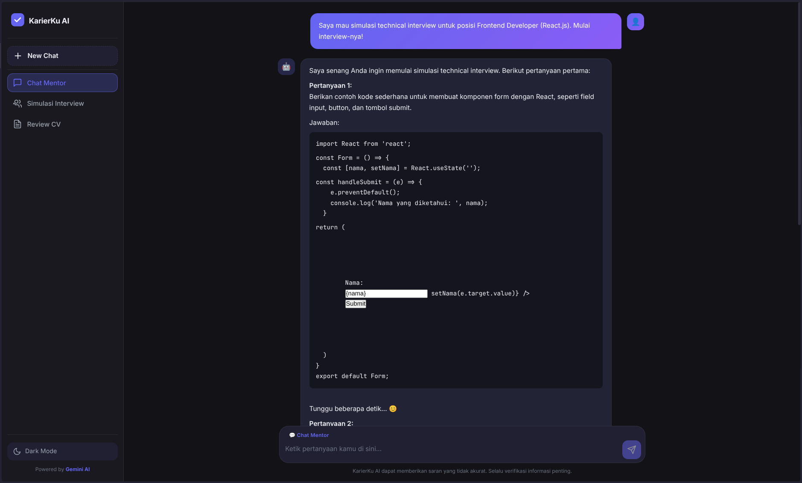

# KarierKu AI — Tech Career & Interview Mentor 🚀

> Asisten virtual berbasis **Ollama Local AI (llama3.2:1b)** yang dirancang khusus untuk membantu pencari kerja di bidang IT — mulai dari simulasi *technical interview*, review CV ala ATS, hingga saran karir dari mentor virtual bernama **"Budi"**.

<div align="center">

-FFFFFF?style=for-the-badge&logo=ollama&logoColor=black)


</div>

---

## 📸 Screenshot

| Dark Mode | Light Mode |
|:---------:|:----------:|
|  |  |

| Simulasi Interview Mode |
|:-----------------------:|
|  |

---

## 📋 Tentang Proyek

**KarierKu AI** adalah aplikasi chatbot *fullstack* yang menggabungkan kecerdasan buatan Ollama secara lokal dengan antarmuka pengguna yang modern dan responsif. Proyek ini dikembangkan sebagai **Final Project Hacktiv8** untuk kelas *AI Productivity & API Integration*.

Chatbot berperan sebagai **"Budi"** — seorang Senior Engineering Manager fiktif dengan 12+ tahun pengalaman di perusahaan tech Indonesia (Tokopedia, Gojek) yang membantu junior developer mempersiapkan karir IT mereka.

---

## ✨ Fitur Utama

| # | Fitur | Deskripsi | Mode |
|---|-------|-----------|------|
| 1 | 💬 **Chat Mentor** | Tanya jawab seputar tips karir, roadmap belajar, dan saran profesional | `Chat Mentor` |
| 2 | 🎯 **Simulasi Interview** | AI bertindak sebagai interviewer teknis — satu pertanyaan per sesi + feedback langsung | `Simulasi Interview` |
| 3 | 📄 **Review CV** | Kritik membangun ala ATS dengan saran perbaikan yang spesifik dan actionable | `Review CV` |
| 4 | 🌙 **Dark / Light Mode** | Toggle tema dengan transisi halus, preferensi disimpan di `localStorage` | Global |
| 5 | 💾 **Memori Percakapan** | AI mengingat konteks chat sepanjang sesi (session-based history di backend) | Global |
| 6 | ➕ **New Chat** | Reset percakapan dan mulai sesi baru kapan saja | Sidebar |

---

## 🛠️ Tech Stack

| Layer | Teknologi | Versi |
|-------|-----------|-------|
| **Frontend** | HTML5, Vanilla CSS (Custom Design System), Vanilla JavaScript | — |
| **Backend** | Node.js + Express.js | Express 5.x |
| **AI Engine** | Ollama Local REST API (Native Fetch) | — |
| **Model** | `llama3.2:1b` | — |
| **Config** | dotenv | 17.x |
| **Dev Tool** | nodemon | 3.x |

---

## ⚙️ Konfigurasi AI (Sesuai PRD)

```
Model            : llama3.2:1b
Temperature      : 0.7   → keseimbangan antara faktual & kreatif
Top P            : 0.9   → variasi kosakata yang natural
Top K            : 40
Max Output Tokens: 1024  → ringkas dan to-the-point
```

**System Instruction — Persona "Budi":**
> Senior Engineering Manager, 12+ tahun pengalaman (ex-Tokopedia, Gojek). Profesional tapi santai, menggunakan bahasa Indonesia dengan istilah tech (`deploy`, `sprint`, `code review`). Mode-aware: perilaku berubah sesuai mode yang dipilih user (Chat / Interview / CV Review).

---

## 🚀 Cara Menjalankan

### 1. Clone Repository

```bash
git clone https://github.com/<username>/HACKTIV8_AI-Productivity-and-API-Integration.git
cd HACKTIV8_AI-Productivity-and-API-Integration
```

### 2. Install Dependencies

```bash
npm install
```

### 3. Konfigurasi Environment

Buat file `.env` di root folder:

```env
PORT=3000
NODE_ENV=development

# Ollama Local AI
OLLAMA_HOST=http://localhost:11434
OLLAMA_MODEL=llama3.2:1b
```

> 💡 Pastikan [Ollama](https://ollama.com/) sudah terinstall dan berjalan di localhost, dan model `llama3.2:1b` sudah di-pull (`ollama pull llama3.2:1b`).

### 4. Jalankan Server

```bash
# Development (auto-reload dengan nodemon)
npm run dev

# Production
npm start
```

### 5. Buka Browser

```
http://localhost:3000
```

### 6. Cek Health API (Opsional)

```bash
curl http://localhost:3000/api/health
```

Output yang diharapkan:
```json
{
  "status": "ok",
  "provider": "ollama",
  "ollamaHost": "http://localhost:11434",
  "model": "llama3.2:1b"
}
```

---

## 📁 Struktur Folder

```
HACKTIV8_AI-Productivity-and-API-Integration/
│
├── 🖥️  index.js              # Backend: Express server + Ollama AI logic
├── 🧪 test-ollama.js         # Script uji koneksi Ollama API
├── 📦 package.json           # Dependencies & npm scripts
│
├── 🔐 .env                   # Konfigurasi Environment variables
├── 🚫 .gitignore             # Mengecualikan .env & node_modules
│
├── 📋 prd.md                 # Product Requirements Document
├── 📖 README.md              # Dokumentasi ini
│
├── 📸 screenshots/           # Screenshot UI untuk dokumentasi
│   ├── dark-mode.png
│   ├── light-mode.png
│   └── interview-mode.png
│
└── 🌐 public/                # Frontend (static files)
    ├── index.html            # Struktur halaman utama
    ├── style.css             # Sistem desain (dark/light, animasi)
    └── script.js             # Logika frontend (Fetch API, mode switching)
```

---

## 🔌 API Endpoints

| Method | Endpoint | Deskripsi |
|--------|----------|-----------|
| `GET` | `/` | Serve halaman frontend utama |
| `GET` | `/api/health` | Cek status server & konfigurasi API key |
| `POST` | `/api/chat` | Kirim pesan ke AI "Budi" |
| `POST` | `/api/clear` | Reset riwayat percakapan untuk sesi ini |

**Contoh Request `/api/chat`:**
```json
POST /api/chat
Content-Type: application/json

{
  "message": "Budi, apa yang harus saya persiapkan sebelum interview di startup tech?",
  "sessionId": "user-session-abc123"
}
```

**Contoh Response:**
```json
{
  "reply": "Pertanyaan bagus! 🎯 Ada beberapa hal penting yang perlu kamu persiapkan..."
}
```

---

## 📊 Alur Kerja Sistem

```
User (Browser)
    │
    │  1. Ketik pesan / pilih mode
    ▼
Frontend (Vanilla JS)
    │
    │  2. POST /api/chat { message, sessionId }
    ▼
Backend (Express.js)
    │
    │  3. Ambil history sesi + susun prompt
    ▼
Ollama API Local (llama3.2:1b)
    │
    │  4. AI response + simpan ke history
    ▼
Backend → Frontend
    │
    │  5. Render chat bubble dengan markdown
    ▼
User (Chat UI terupdate)
```

---

## ✅ Success Metrics (PRD Checklist)

- [x] Chatbot **membalas pesan secara dinamis** (tidak statis/hardcoded)
- [x] **System Instruction** sesuai persona "Budi" dengan mode-aware behavior
- [x] **Parameter AI** dikonfigurasi sesuai PRD (temperature, topP, maxTokens)
- [x] **Session-based chat history** — AI mengingat konteks percakapan
- [x] **UI responsif** — mendukung dark mode, light mode, dan mobile
- [x] **Error handling** — pesan error informatif jika Ollama tidak aktif
- [x] **Repositori GitHub Public** dengan source code lengkap
- [x] **Screenshot UI** tersedia di folder `/screenshots`

---

## 👨‍💻 Author

Dibuat sebagai **Final Project Hacktiv8** — Kelas AI Productivity & API Integration

---

## 📄 License

MIT License — bebas digunakan dan dimodifikasi.
